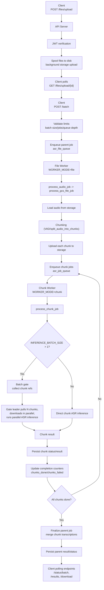

## Welcome

The Dhrith ASR API is a batch transcription service for Indian multilingual speech. Upload audio files or provide URLs, submit batches for transcription, track processing progress, and retrieve merged transcripts at scale.

Use this API to:

- Upload files asynchronously and poll upload status.
- Submit batches from completed uploads and/or explicit GCS keys or URLs.
- Track progress at batch level and fetch merged results per file.

If you are new to the TensorStudio docs flow, start from the [API Keys](https://docs.tensorstudio.ai/apis).

## 1) Dhrith ASR Overview

### Processing flow

1. Client sends `POST /files/upload` with multipart files.
2. Client polls `GET /files/upload/{batch_upload_id}` until uploads complete.
3. Client sends `POST /batch` with `batch_upload_id`, `file_ids`, and/or a `sources` list.
4. Client polls status endpoints or fetches paginated/downloadable results.

### Authentication

Application endpoints require JWT and expect:

`Authorization: Bearer <JWT_TOKEN>`

The token is validated against JWKS. Missing or invalid tokens return `401`.

### IDs you will use

- `batch_upload_id`: groups files from one upload request.
- `batch_id`: groups everything from one transcription submission.
- `file_id`: stable ID for one source file/URL and its merged result.

## 2) Features and Metrics

### Core features

- **Async file upload**: spool-to-disk with background storage upload.
- **Batch input support**: completed uploads, specific uploaded files by `file_id`, explicit GCS keys, and remote audio URLs in one batch request.
- **File management**: list and delete uploaded files.

### Operational metrics exposed by API responses

- Upload metrics:
  - `spool_seconds`, `upload_status` per file
  - `completed`, `failed`, `uploading`, `pending` counters
- Submission estimates:
  - `estimated_audio_seconds`
  - `estimated_completion_seconds`
- Batch progress counters:
  - `total_files`, `files_completed`, `files_failed`, `files_processing`
  - In development mode: `total_jobs`, `completed_jobs`, `failed_jobs`, `processing_jobs`, `queued_jobs`

### Default pagination behavior

- `GET /files` and results endpoints default:
  - `page=1`
  - `limit=50`
  - max `limit=200`

## 3) Endpoints and Usage

File endpoints use base URL `https://api.soket.ai`. Batch transcription, status, results, and download endpoints use `https://api.soket.ai/transcribe`.

## `POST /files/upload`

Upload one or more audio files. Returns `202 Accepted` immediately with a `batch_upload_id`. Background storage upload continues after the response.

### Example

```bash
curl -X POST "https://api.soket.ai/files/upload" \
  -H "Authorization: Bearer $JWT_TOKEN" \
  -F "files=@/absolute/path/audio1.wav" \
  -F "files=@/absolute/path/audio2.mp3"
```

### Typical response

```json
{
  "batch_upload_id": "a1b2c3d4-e5f6-7890-abcd-ef1234567890",
  "status": "accepted",
  "total_files": 2,
  "spool_seconds": 0.42,
  "files": [
    {
      "file_id": "1374132b-b5db-4ec3-9cf1-f61f982e89b0",
      "filename": "audio1.wav",
      "size_bytes": 1048576,
      "estimated_duration_seconds": 65.5,
      "upload_status": "pending"
    }
  ]
}
```

## `GET /files/upload/{batch_upload_id}`

Poll upload progress. Returns per-file `upload_status` and `gcs_key` for completed files.

### Example

```bash
curl -X GET "https://api.soket.ai/files/upload/$BATCH_UPLOAD_ID" \
  -H "Authorization: Bearer $JWT_TOKEN"
```

## `GET /files`

List all files uploaded by the authenticated user.

### Query params

- `page` (default: `1`)
- `limit` (default: `50`, max: `200`)
- `upload_status` (optional): `pending`, `uploading`, `completed`, `failed`

### Example

```bash
curl -X GET "https://api.soket.ai/files?upload_status=completed" \
  -H "Authorization: Bearer $JWT_TOKEN"
```

## `DELETE /files`

Delete one or more uploaded files by `file_id`.

### Example

```bash
curl -X DELETE "https://api.soket.ai/files" \
  -H "Authorization: Bearer $JWT_TOKEN" \
  -H "Content-Type: application/json" \
  -d '{"file_ids": ["1374132b-b5db-4ec3-9cf1-f61f982e89b0"]}'
```

## `POST /batch`

Submit a batch for transcription with a JSON body:

- `batch_upload_id` (optional): include all completed files from one upload
- `file_ids` (optional): list of specific `file_id` strings from prior uploads
- `sources` (optional): list of `{ gcs_key, filename }` or `{ url, filename }` items

At least one of `batch_upload_id`, `file_ids`, or `sources` must resolve to at least one file. All fields can be combined.

### Example (from completed upload)

```bash
curl -X POST "https://api.soket.ai/transcribe/batch" \
  -H "Authorization: Bearer $JWT_TOKEN" \
  -H "Content-Type: application/json" \
  -d '{"batch_upload_id": "a1b2c3d4-e5f6-7890-abcd-ef1234567890"}'
```

### Example (specific file_ids)

```bash
curl -X POST "https://api.soket.ai/transcribe/batch" \
  -H "Authorization: Bearer $JWT_TOKEN" \
  -H "Content-Type: application/json" \
  -d '{"file_ids": ["1374132b-b5db-4ec3-9cf1-f61f982e89b0", "2485243c-c6ec-5fd4-0dg2-g72g093f90c1"]}'
```

### Example (upload batch + URLs)

```bash
curl -X POST "https://api.soket.ai/transcribe/batch" \
  -H "Authorization: Bearer $JWT_TOKEN" \
  -H "Content-Type: application/json" \
  -d '{
    "batch_upload_id": "a1b2c3d4-e5f6-7890-abcd-ef1234567890",
    "sources": [
      {"url": "https://example.com/audio3.wav", "filename": "audio3.wav"}
    ]
  }'
```

### Typical response

```json
{
  "batch_id": "0f8fad5b-d9cb-469f-a165-70867728950e",
  "total_jobs": 3,
  "estimated_audio_seconds": 290.0,
  "estimated_completion_seconds": 21.7,
  "jobs": [
    {
      "file_id": "1374132b-b5db-4ec3-9cf1-f61f982e89b0",
      "filename": "audio1.wav",
      "batch_id": "0f8fad5b-d9cb-469f-a165-70867728950e",
      "status": "queued"
    }
  ]
}
```

## `GET /status/batch/{batch_id}`

Returns aggregate progress across files and chunk jobs in the batch.

### Typical response (production)

```json
{
  "batch_id": "0f8fad5b-d9cb-469f-a165-70867728950e",
  "total_files": 3,
  "files_completed": 2,
  "files_failed": 0,
  "estimated_audio_seconds": 290.0,
  "estimated_completion_seconds": 21.7,
  "status": "processing"
}
```

In development mode, this response also includes job counters:
`total_jobs`, `completed_jobs`, `failed_jobs`, `processing_jobs`, `queued_jobs`, and `files_processing`.

### Example

```bash
curl -X GET "https://api.soket.ai/transcribe/status/batch/$BATCH_ID" \
  -H "Authorization: Bearer $JWT_TOKEN"
```

## `GET /results/batch/{batch_id}`

Paginated results endpoint.

### Query params

- `status` (optional): `completed`, `failed`, `retrying`, `processing`
- `page` (default: `1`)
- `limit` (default: `50`, max: `200`)
- `raw` (default: `false`)  
  - `false`: merged per-file results
  - `true`: raw per-job records
- `chunks` (optional bool): include chunk-level results inline when enabled
- `speech_information` (optional bool): include segment-level speech information (tone, accent, speaker_id, timestamps, etc.)

### Example (merged, completed-only)

```bash
curl -X GET "https://api.soket.ai/transcribe/results/batch/$BATCH_ID?status=completed&page=1&limit=100" \
  -H "Authorization: Bearer $JWT_TOKEN"
```

### Example (raw job records)

```bash
curl -X GET "https://api.soket.ai/transcribe/results/batch/$BATCH_ID?raw=true&page=1&limit=100" \
  -H "Authorization: Bearer $JWT_TOKEN"
```

### Typical response shape

- `raw=false` (default):  
  `{ batch_id, page, limit, total_pages, total_files, count, files: [...] }`
- `raw=true`:  
  `{ batch_id, page, limit, total_pages, total_jobs, count, jobs: [...] }`
- If batch does not exist and no status filter is applied:  
  `{ "error": "batch not found" }`

## `GET /results/file/{file_id}`

Returns merged transcript and status for one file.

### Query params

- `chunks` (optional bool): include per-chunk details
- `speech_information` (optional bool): include segment-level speech information

### Example

```bash
curl -X GET "https://api.soket.ai/transcribe/results/file/$FILE_ID?chunks=true" \
  -H "Authorization: Bearer $JWT_TOKEN"
```

### Typical response shape

- Found file: `{ file_id, filename, status, result?, errors?, chunk_results? }`
- Not found: `{ "error": "file not found" }`

In development mode, additional counters such as `total_chunks`, `completed_chunks`, and `failed_chunks` are included.

## `GET /download/batch/{batch_id}`

Download all results for a batch as stream.

### Query params

- `status` (optional)
- `format` (default: `ndjson`): `ndjson` or `json`
- `raw` (default: `false`): raw per-job instead of merged per-file
- `chunks` (optional bool): include chunk payloads in merged output
- `speech_information` (optional bool): include segment-level speech information in merged output

### Example (NDJSON export)

```bash
curl -L -o "batch_results.ndjson" \
  "https://api.soket.ai/transcribe/download/batch/$BATCH_ID?format=ndjson" \
  -H "Authorization: Bearer $JWT_TOKEN"
```

### Example (JSON export with filter)

```bash
curl -L -o "batch_completed.json" \
  "https://api.soket.ai/transcribe/download/batch/$BATCH_ID?status=completed&format=json" \
  -H "Authorization: Bearer $JWT_TOKEN"
```

## 4) Examples

### Example A: Complete batch lifecycle

```bash
# 1) Upload files
UPLOAD=$(curl -s -X POST "https://api.soket.ai/files/upload" \
  -H "Authorization: Bearer $JWT_TOKEN" \
  -F "files=@/absolute/path/call_001.wav")

echo "$UPLOAD"
BATCH_UPLOAD_ID=$(echo "$UPLOAD" | python -c 'import sys,json; print(json.load(sys.stdin)["batch_upload_id"])')

# 2) Poll upload status until completed
curl -s -X GET "https://api.soket.ai/files/upload/$BATCH_UPLOAD_ID" \
  -H "Authorization: Bearer $JWT_TOKEN"

# 3) Submit batch
RESP=$(curl -s -X POST "https://api.soket.ai/transcribe/batch" \
  -H "Authorization: Bearer $JWT_TOKEN" \
  -H "Content-Type: application/json" \
  -d "{\"batch_upload_id\": \"$BATCH_UPLOAD_ID\"}")

echo "$RESP"
BATCH_ID=$(echo "$RESP" | python -c 'import sys,json; print(json.load(sys.stdin)["batch_id"])')
FILE_ID=$(echo "$RESP" | python -c 'import sys,json; print(json.load(sys.stdin)["jobs"][0]["file_id"])')

# 4) Poll batch status
curl -s -X GET "https://api.soket.ai/transcribe/status/batch/$BATCH_ID" \
  -H "Authorization: Bearer $JWT_TOKEN"

# 5) Fetch first page of merged file results
curl -s -X GET "https://api.soket.ai/transcribe/results/batch/$BATCH_ID?page=1&limit=50" \
  -H "Authorization: Bearer $JWT_TOKEN"

# 6) Fetch one file result directly
curl -s -X GET "https://api.soket.ai/transcribe/results/file/$FILE_ID" \
  -H "Authorization: Bearer $JWT_TOKEN"

# 7) Download full export
curl -L -o "batch_${BATCH_ID}.ndjson" \
  "https://api.soket.ai/transcribe/download/batch/$BATCH_ID?format=ndjson" \
  -H "Authorization: Bearer $JWT_TOKEN"
```

### Example B: Get one file's merged transcript

```bash
curl -s -X GET "https://api.soket.ai/transcribe/results/file/$FILE_ID" \
  -H "Authorization: Bearer $JWT_TOKEN"
```

## Error handling quick reference

- `400`: invalid input or batch constraints violated.
- `401`: missing/invalid JWT.
- `404`: upload batch, batch, file, or `file_ids` not found.
- `409`: uploads still in progress or `file_ids` not yet completed when submitting batch.
- `429`: quota exceeded (if quota checks are enabled).
- `503`: queue saturation or operational dependency unavailable.

## Notes for production docs

- Keep JWT examples as environment variable placeholders (`$JWT_TOKEN`), never hardcoded tokens.
- Recommend NDJSON for large exports due to streaming-friendliness.
- For UI polling, use `GET /status/batch/{batch_id}` as the lightweight progress endpoint.
- Poll `GET /files/upload/{batch_upload_id}` before calling `POST /batch`.

## 5) Architecture and Queue Workflow

When a batch is submitted, the system runs a two-stage queue pipeline:

1. Parent file jobs (one per input file/URL) on the file queue.
2. Child chunk jobs (fan-out after chunking) on the chunk queue.



### Queue map

- `asr_file_queue`: primary queue for parent jobs submitted by `POST /batch`.
- `asr_job_queue`: primary queue for chunk jobs created during parent fan-out.
- `file_retry_queue` (optional): dedicated retry lane for parent jobs. Only active when `SEPARATE_RETRY_QUEUES=true`.
- `job_retry_queue` (optional): dedicated retry lane for chunk jobs. Only active when `SEPARATE_RETRY_QUEUES=true`.

### Retry modes

The system supports two retry modes, controlled by the `SEPARATE_RETRY_QUEUES` environment variable:

**Default (`SEPARATE_RETRY_QUEUES=false`)**: failed jobs are automatically re-enqueued on the same primary queue after configured intervals. Simple and reliable.

**Separate retry queues (`SEPARATE_RETRY_QUEUES=true`)**: Failed jobs are manually re-enqueued onto dedicated retry queues (`file_retry_queue`, `job_retry_queue`) by custom failure callbacks. Workers listen on `[primary, retry]` in that order, so fresh jobs always take priority over retries. Use this when you need retry jobs to have lower scheduling priority than new work.

Related env vars for separate mode:
- `CHUNK_MAX_RETRIES_SEPARATE` (default `3`): max retry attempts before permanent failure.
- `CHUNK_RETRY_INTERVALS_SEPARATE` (default `30,60,120`): delay in seconds between retry attempts.
- `SAVE_AUDIO_DATA` (default `true`): when `true`, raw audio bytes and metadata are saved for debugging and replay; set to `false` to skip audio-data persistence.

### Major processes

- **Upload ingress**: auth, size limits, spool-to-disk, background storage upload.
- **Batch ingress and validation**: auth, limits, back-pressure checks, and job enqueue.
- **Parent stage**: normalize source input, load source audio, chunk, and enqueue child jobs.
- **Chunk stage**: inference through direct ASR calls or batch gate coordination.
- **Persistence and counters**: update job stores and completion counters.
- **Finalize and expose**: merge chunk transcriptions into parent result, then serve via status/results/download endpoints.

### Failure and retry scenarios

- **Transient network or inference errors**:
  - chunk/parent status is marked `retrying`
  - default mode: automatic retries on the same queue with configured intervals
  - separate mode: failure callback re-enqueues onto the retry queue with a delay
  - work remains isolated to failed jobs/chunks
- **Chunk permanently fails after retries**:
  - chunk marked `failed`
  - `_on_chunk_terminal` still advances completion accounting
  - parent finalizes as `partial` if at least one chunk failed
- **Parent fails mid-fanout after some chunks enqueued**:
  - parent marked `failed` to avoid duplicate enqueue on retry
  - already-enqueued child chunks continue to terminal state
- **Worker crash or stale in-flight state**:
  - startup recovery requeues stale in-flight jobs
  - stuck chunk recovery marks orphaned processing chunks as failed
- **Queue pressure**:
  - API may reject new batch submissions with `503` when queue depth limits are exceeded
