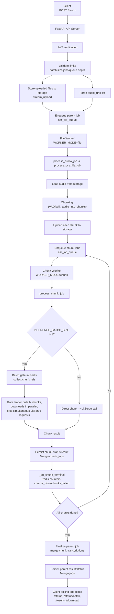

# Dhrith ASR API

The Dhrith ASR API is a batch transcription service built on FastAPI + Redis Queue (RQ) + MongoDB, with ASR inference handled by LitServe.

Use this API to:

- Submit files and/or audio URLs in one batch request.
- Track progress at batch level (and job level when `job_id` is available).
- Retrieve merged per-file transcripts (or raw job records).
- Download large result sets as NDJSON/JSON.
- Check queue and inference-service health for operations.

If you are new to the TensorStudio docs flow, start from the [Playground quickstart](https://docs.tensorstudio.ai/quickstart_playground).

## 1) Dhrith ASR Overview

### Processing flow

1. Client sends `POST /batch` with files and/or `audio_urls`.
2. API streams uploaded files to storage and enqueues parent jobs in Redis.
3. Workers split and process audio chunks, call LitServe ASR, and persist progress/results in MongoDB.
4. Client polls status endpoints or fetches paginated/downloadable results.

### Authentication

Application endpoints require JWT and expect:

`Authorization: Bearer <JWT_TOKEN>`

The token is validated against JWKS. Missing or invalid tokens return `401`.

Health endpoints (`GET /health/queues`, `GET /health/inference`) are intended for operational checks and are available without JWT.

### IDs you will use

- `batch_id`: groups everything from one submission.
- `job_id`: parent job ID returned at submit time.
- `file_id`: stable ID for one source file/URL and its merged result.
- `rq_job_id`: Redis queue job identifier for internal tracking.

## 2) Features and Metrics

### Core features

- **Batch input support**: local file uploads and remote audio URLs in one request.
- **Chunk-aware processing**: long files are processed in chunks and merged into one transcript.
- **File-level aggregation**: returns per-file status and merged transcript output.
- **Streaming exports**: download full batch results as NDJSON (recommended for large batches) or JSON array.
- **Queue health API**: exposes queue depth and LitServe concurrency occupancy for autoscaling/ops.

### Operational metrics exposed by API responses

- Submission estimates:
  - `estimated_audio_seconds`
  - `estimated_completion_seconds`
- Batch progress counters:
  - `total_files`, `total_jobs`
  - `completed_jobs`, `failed_jobs`, `processing_jobs`, `queued_jobs`
  - `files_completed`, `files_failed`, `files_processing`
- Queue health telemetry (`GET /health/queues`):
  - queue depth + max depth for file/job/retry queues
  - semaphore `inflight`, `capacity`, `available`, `saturated`

### Default pagination behavior

- `results` endpoint defaults:
  - `page=1`
  - `limit=50`
  - max `limit=200`

## 3) Endpoints and Usage

Base URL examples below use `http://localhost:8000`. Replace with your deployed host in production.

## `GET /protected`

Returns token-derived identity and limits for verification.

### Example

```bash
curl -X GET "http://localhost:8000/protected" \
  -H "Authorization: Bearer $JWT_TOKEN"
```

## `GET /health/queues`

Operational health snapshot of queue depth and LitServe semaphore occupancy.

### Example

```bash
curl -X GET "http://localhost:8000/health/queues"
```

## `GET /health/inference`

Connectivity check for the inference service used by workers.

### Example

```bash
curl -X GET "http://localhost:8000/health/inference"
```

## `POST /batch`

Submit one batch with:

- `files`: multipart file fields (optional)
- `audio_urls`: JSON array string in multipart form (optional)

At least one of `files` or `audio_urls` is required.

### Example (files + URLs)

```bash
curl -X POST "http://localhost:8000/batch" \
  -H "Authorization: Bearer $JWT_TOKEN" \
  -F "files=@/absolute/path/audio1.wav" \
  -F "files=@/absolute/path/audio2.mp3" \
  -F 'audio_urls=["https://example.com/audio3.wav","https://example.com/audio4.mp3"]'
```

### Typical response

```json
{
  "batch_id": "0f8fad5b-d9cb-469f-a165-70867728950e",
  "total_jobs": 4,
  "estimated_audio_seconds": 290.0,
  "estimated_completion_seconds": 21.7,
  "jobs": [
    {
      "file_id": "1374132b-b5db-4ec3-9cf1-f61f982e89b0",
      "filename": "audio1.wav",
      "batch_id": "0f8fad5b-d9cb-469f-a165-70867728950e",
      "status": "queued"
    }
  ]
}
```

In development mode, each `jobs[]` item additionally includes internal fields such as `job_id`, `rq_job_id`, `type`, and `estimated_audio_seconds`.

## `GET /status/{job_id}`

Returns one job status/result document.

- If the job is already persisted in MongoDB, you get the full stored job document.
- If still in memory/queue, you get the in-flight metadata (with current RQ status when available).
- If not found, response is `{ "error": "not found" }`.

`job_id` is typically available in development/internal flows. Production clients usually track by `batch_id` and `file_id`.

### Example

```bash
curl -X GET "http://localhost:8000/status/$JOB_ID" \
  -H "Authorization: Bearer $JWT_TOKEN"
```

## `GET /status/batch/{batch_id}`

Returns aggregate progress across files and chunk jobs in the batch.

### Typical response (production)

```json
{
  "batch_id": "0f8fad5b-d9cb-469f-a165-70867728950e",
  "total_files": 4,
  "files_completed": 2,
  "files_failed": 0,
  "estimated_audio_seconds": 290.0,
  "estimated_completion_seconds": 21.7,
  "status": "processing"
}
```

In development mode, this response also includes job counters:
`total_jobs`, `completed_jobs`, `failed_jobs`, `processing_jobs`, `queued_jobs`, and `files_processing`.

### Example

```bash
curl -X GET "http://localhost:8000/status/batch/$BATCH_ID" \
  -H "Authorization: Bearer $JWT_TOKEN"
```

## `GET /results/batch/{batch_id}`

Paginated results endpoint.

### Query params

- `status` (optional): `completed`, `failed`, `retrying`, `processing`
- `page` (default: `1`)
- `limit` (default: `50`, max: `200`)
- `raw` (default: `false`)  
  - `false`: merged per-file results
  - `true`: raw per-job records
- `chunks` (optional bool):
  - include chunk-level results inline when enabled

### Example (merged, completed-only)

```bash
curl -X GET "http://localhost:8000/results/batch/$BATCH_ID?status=completed&page=1&limit=100" \
  -H "Authorization: Bearer $JWT_TOKEN"
```

### Example (raw job records)

```bash
curl -X GET "http://localhost:8000/results/batch/$BATCH_ID?raw=true&page=1&limit=100" \
  -H "Authorization: Bearer $JWT_TOKEN"
```

### Typical response shape

- `raw=false` (default):  
  `{ batch_id, page, limit, total_pages, total_files, count, files: [...] }`
- `raw=true`:  
  `{ batch_id, page, limit, total_pages, total_jobs, count, jobs: [...] }`
- If batch does not exist and no status filter is applied:  
  `{ "error": "batch not found" }`

## `GET /results/file/{file_id}`

Returns merged transcript and status for one file.

### Query params

- `chunks` (optional bool): include per-chunk details

### Example

```bash
curl -X GET "http://localhost:8000/results/file/$FILE_ID?chunks=true" \
  -H "Authorization: Bearer $JWT_TOKEN"
```

### Typical response shape

- Found file: `{ file_id, filename, status, result?, errors?, chunk_results? }`
- Not found: `{ "error": "file not found" }`

In development mode, additional counters such as `total_chunks`, `completed_chunks`, and `failed_chunks` are included.

## `GET /download/batch/{batch_id}`

Download all results for a batch as stream.

### Query params

- `status` (optional)
- `format` (default: `ndjson`): `ndjson` or `json`
- `raw` (default: `false`): raw per-job instead of merged per-file
- `chunks` (optional bool): include chunk payloads in merged output

### Example (NDJSON export)

```bash
curl -L -o "batch_results.ndjson" \
  "http://localhost:8000/download/batch/$BATCH_ID?format=ndjson" \
  -H "Authorization: Bearer $JWT_TOKEN"
```

### Example (JSON export with filter)

```bash
curl -L -o "batch_completed.json" \
  "http://localhost:8000/download/batch/$BATCH_ID?status=completed&format=json" \
  -H "Authorization: Bearer $JWT_TOKEN"
```

## 4) Examples

### Example A: Complete batch lifecycle

```bash
# 1) Submit
RESP=$(curl -s -X POST "http://localhost:8000/batch" \
  -H "Authorization: Bearer $JWT_TOKEN" \
  -F "files=@/absolute/path/call_001.wav")

echo "$RESP"
BATCH_ID=$(echo "$RESP" | python -c 'import sys,json; print(json.load(sys.stdin)["batch_id"])')
FILE_ID=$(echo "$RESP" | python -c 'import sys,json; print(json.load(sys.stdin)["jobs"][0]["file_id"])')

# 2) Poll batch status
curl -s -X GET "http://localhost:8000/status/batch/$BATCH_ID" \
  -H "Authorization: Bearer $JWT_TOKEN"

# 3) Fetch first page of merged file results
curl -s -X GET "http://localhost:8000/results/batch/$BATCH_ID?page=1&limit=50" \
  -H "Authorization: Bearer $JWT_TOKEN"

# 3b) Fetch one file result directly
curl -s -X GET "http://localhost:8000/results/file/$FILE_ID" \
  -H "Authorization: Bearer $JWT_TOKEN"

# 4) Download full export
curl -L -o "batch_${BATCH_ID}.ndjson" \
  "http://localhost:8000/download/batch/$BATCH_ID?format=ndjson" \
  -H "Authorization: Bearer $JWT_TOKEN"
```

### Example B: Get one file's merged transcript

```bash
curl -s -X GET "http://localhost:8000/results/file/$FILE_ID" \
  -H "Authorization: Bearer $JWT_TOKEN"
```

### Example C: Queue health check for autoscaling signal

```bash
curl -s "http://localhost:8000/health/queues"
```

### Example D: Inference connectivity check

```bash
curl -s "http://localhost:8000/health/inference"
```

Monitor:

- rising `queues.file_queue.depth` / `queues.job_queue.depth`
- `litserve_semaphore.saturated = true`

These indicate throughput pressure and likely need for worker/concurrency scaling.

## Error handling quick reference

- `400`: invalid input or batch constraints violated.
- `401`: missing/invalid JWT.
- `404`: batch not found (download endpoint).
- `429`: quota exceeded (if quota checks are enabled).
- `503`: queue saturation or operational dependency unavailable.

## Notes for production docs

- Keep JWT examples as environment variable placeholders (`$JWT_TOKEN`), never hardcoded tokens.
- Recommend NDJSON for large exports due to streaming-friendliness.
- For UI polling, use `GET /status/batch/{batch_id}` as the lightweight progress endpoint.

## 5) Architecture and Queue Workflow

When a batch is submitted, the system runs a two-stage queue pipeline:

1. Parent file jobs (one per input file/URL) on the file queue.
2. Child chunk jobs (fan-out after chunking) on the chunk queue.



### Queue map

- `asr_file_queue`: primary queue for parent jobs submitted by `POST /batch`.
- `asr_job_queue`: primary queue for chunk jobs created during parent fan-out.
- `file_retry_queue` (optional): dedicated retry lane for parent jobs. Only active when `SEPARATE_RETRY_QUEUES=true`.
- `job_retry_queue` (optional): dedicated retry lane for chunk jobs. Only active when `SEPARATE_RETRY_QUEUES=true`.

### Retry modes

The system supports two retry modes, controlled by the `SEPARATE_RETRY_QUEUES` environment variable:

**Default (`SEPARATE_RETRY_QUEUES=false`)**: RQ's built-in `retry=` parameter re-enqueues failed jobs back onto the same primary queue after configured intervals. Simple and reliable.

**Separate retry queues (`SEPARATE_RETRY_QUEUES=true`)**: Failed jobs are manually re-enqueued onto dedicated retry queues (`file_retry_queue`, `job_retry_queue`) by custom failure callbacks. Workers listen on `[primary, retry]` in that order, so fresh jobs always take priority over retries. Use this when you need retry jobs to have lower scheduling priority than new work.

Related env vars for separate mode:
- `CHUNK_MAX_RETRIES_SEPARATE` (default `3`): max retry attempts before permanent failure.
- `CHUNK_RETRY_INTERVALS_SEPARATE` (default `30,60,120`): delay in seconds between retry attempts.
- `SAVE_AUDIO_DATA` (default `true`): when `true`, raw audio bytes and metadata are saved to Mongo `audio_data`; set to `false` to skip audio-data persistence.

### Major processes

- **Ingress and validation**: auth, limits, back-pressure checks, and storage upload.
- **Parent stage**: normalize source input, load source audio, chunk, and enqueue child jobs.
- **Chunk stage**: inference through direct LitServe call or batch gate coordination.
- **Persistence and counters**: update Mongo (`jobs`, `chunk_jobs`) plus Redis completion counters.
- **Finalize and expose**: merge chunk transcriptions into parent result, then serve via status/results/download endpoints.

### Failure and retry scenarios

- **Transient network/5xx to LitServe**:
  - chunk/parent status is marked `retrying`
  - default mode: RQ retries on the same queue with configured intervals
  - separate mode: failure callback re-enqueues onto the retry queue with a delay
  - work remains isolated to failed jobs/chunks
- **Chunk permanently fails after retries**:
  - chunk marked `failed`
  - `_on_chunk_terminal` still advances completion accounting
  - parent finalizes as `partial` if at least one chunk failed
- **Parent fails mid-fanout after some chunks enqueued**:
  - parent marked `failed` to avoid duplicate enqueue on retry
  - already-enqueued child chunks continue to terminal state
- **Worker crash or stale in-flight state**:
  - startup recovery requeues stale RQ jobs
  - stuck chunk recovery marks orphaned processing chunks as failed
- **Queue pressure**:
  - API may reject new batch submissions with `503` when queue depth limits are exceeded
  - use `GET /health/queues` for autoscaling and saturation signals
